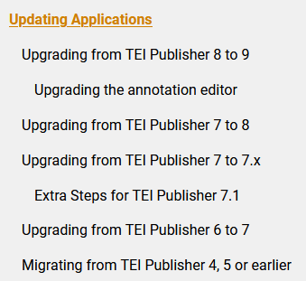

# Parzivals ODD‑Âventiuren

Die Suche nach dem ewig wartbaren Gral

<style>
  .slide { background: url(img/dsl0.png) center; background-size: cover }
#  .content { filter: invert() }
  code { opacity: 0.8 }
</style>

---

[https://dsl-unibe-ch.github.io/parzival-proto4digEd](https://dsl-unibe-ch.github.io/parzival-proto4digEd)


---

## Parzival-Legacy

[](https://parzival.unibe.ch/parzdb/index.php)

<style>
    .slide img {
        max-height: 500px;        
    }
</style>
---
### Legacy Workflow

Tustep
`$<*T 103.06>_<vara1>der</var> küniginne über driu lant,`

--> TXT<br />
`21;r;a;103;6;;d(er) kvneginne vber driv lant`

--> SQL-DB --> php --> HTML
`<td><span class="versheader">103.<a name="103.6">6</a></span> <span class="vers-content">d<span class="7">(er)</span> kvneginne vber driv lant</span></td>`

---

## Pilotanwendung TEIPublisher

erste Idee: klassischer TEIPublisher-Stack

Anspruch: Funktionserhalt, UI/UX-Entscheidungen beibehalten

---


---


---

[](https://dhbern.github.io/presentation_parzival/textzeugen/d-mk/719/25)

---

### roadblocks

---

#### Revisionskontrolle

---
Unser Versuch

Single source of truth: github repository.

Wenn sich Daten in github ändern: gh-action vergleicht mit TEI-Publisher und pusht via API

Wenn sich Daten in TEI-Publisher ändern: XQuery Trigger startet gh-action, die Dateien vergleicht.

---

Organisation der Seite passt nicht zu XML-Struktur
<!-- bei Fassungen -->
[Synoptische XML](https://github.com/DHBern/parzival-static-api/blob/master/dist/api/tei/original/syn2.xml) als Grundlage
``` xml
<text>
<body>
<div type="Dreissiger" subtype="d" n="2">
<div type="Textteil" subtype="d" n="2">
<head>*D</head>
```

---

#### Fehlende webcomponents-Expertise am DSL
[](https://cdn.tei-publisher.com/@2.23.2/dist/api.html#pb-document.0)
<style>
    .slide img {
        max-height: 400px;        
    }
</style>
---

### neues Konzept

TEIPublisher nur für rendering der text views / Transkriptionen

```
fetch(
`${teipb}/parts/${element.handle}.xml/json
?odd=parzival.odd
&view=single
&xpath=//text/body/l[@xml:id=%27${element.handle}_${thirties}.${verse}%27]`)
```

kleingranular möglich durch [XQuery-API (rendered snippets)](https://dhbern.github.io/presentation_parzival/einzelverssynopse/103/07)

---

ODD nur CSS-Klassen
```
<elementSpec ident="seg" mode="change">
    <model behaviour="inline" cssClass="glory-initial">
        <param name="subtype" value="Prachtinitiale"/>
    </model>
    <model behaviour="inline" cssClass="initial" useSourceRendition="true">
        <param name="type" value="Initiale"/>
    </model>
</elementSpec>
```
Funktionalität und Design nur im Frontend

---

[statisches Backend](https://github.com/DHBern/parzival-static-api/blob/master/dist/api/json/contiguous_ranges.json)
```json
{
  "meta": {
    "generated-by": "parzival-static-api\/src\/generate.xsl",
    "task": "contiguous-ranges",
    "generated-on": "2024-09-04T16:16:13.951621295Z",
    "description": "Contiguous ranges of 'Dreissiger' for each edited document;
    this is the backbone for the overview\/linking visualisation a.k.a. 'devil's table'."
  },
  "contiguous-ranges": [
    {
      "values": [
        [ 421, 429 ],
        [ 636, 644 ]
      ],
      "label": "fr1"
    },
  ]
}
```
<style>
  code {
    line-height: 1.1 !important;    
  }
</style>
Strukturdateien und Metadaten versionskontrolliert über eigene API (skriptbasiert, GH Actions) als Grundlage für [erweiterte Features](https://dhbern.github.io/presentation_parzival/)

---

## Wo stehen wir?

<span hidden>
Damit haben wir eine Lösung gefunden, die für uns soweit funktioniert. Dennoch möchten wir die Möglichkeit dieses Workshops nutzen, um ein paar kritische Anmerkungen zum TEIPublisher und seiner Entwicklung zu machen.

Dabei ist es wichtig hervorzuheben, dass unsere Erfahrung und unsere Kenntnisse mit dem konkreten Modell und Ansatz limitiert sind. Wir haben das eine oder andere dazu gehört, gelesen oder gemacht, steckten bisher aber kein Herzblut rein. Diese Tatsache könnte unsere Kritik delegitimieren, aber wir sehen es selber anders: gerade was den Langzeitbetrieb von digitalen Ressourcen in einer lückenhaften institutionellen Landschaft ohne ausreichende dauerhafte Finanzierung betrifft, scheint uns der Mangel vertiefter Kenntnis durchaus repräsentativ. 

Für einen “Techniker”, der sich in ein paar Jahren um eine verwaisende Edition kümmern soll, ist ein gewisses Informationsdefizit typisch (wir haben es bei Parzival ja selber gerade erlebt). Als Mitarbeiter einer interfakultären support unit, die sowohl entstehende Projekte begleiten als auch ältere Relikte am Laufen zu halten versuchen, bewerten wir die aktuelle Situation folgendermassen:

</span>

---

### Wünschenswert

* **abgrenzbare Einheiten** (Modularität) mit klarem Zweck (Funktionalität)

* **Dokumentation** (*sweet spot*: alles Betriebsrelevante prominent vorhanden; alles Weitere so konzise wie möglich)

* **reduzierte Serverabhängigkeit** (statisch, was statisch geht)

* **ODD-Generierung umgebungsunabhängig**

<span style="font-size:0.5em;line-height:0.5em;">In näherer Zukunft setzen wir uns aber auch mit dem "klassischen" Betrieb auseinander (als Dienstleistungsangebot von UB/DH/DSL).</span>

<span hidden>
Wir schätzen klar greifbare Einheiten, deren Funktionalitäten möglichst offensichtlich sind, und die gut, aber nicht zu kleinteilig dokumentiert sind. Am liebsten sind uns Dinge, die sich als statische Ressourcen bereitstellen lassen (serverseitig) oder die in breit etablierten, ausgereiften Umgebungen laufen. Containerisierung wäre für uns grundsätzlich auch interessant, aber die Unterstützung durch die Informatikdienste ist bisher eher bescheiden.

Wir würden es daher sehr begrüssen, wenn sich der ODD-Ansatz unabhängig von bestimmten Serveranwendungen nutzen liesse. Beispielsweise durch ODD-Generierung mit einem XSLT- oder XQuery-Prozessor (standalone) [Saxon, atop]. Wolfgang Meier hat vor längerer Zeit einmal auf der TEI-Liste angedeutet, dass das grundsätzlich möglich sein sollte. Je nach den Ergebnissen dieses Austauschs werden wir vielleicht einmal einen Versuch wagen.

Entsprechend gespannt sind wir auf den folgenden Vortrag zu “TEI-Publisher-Editionen als ‘statische’ Lösungen”.

Der TEI-Publisher in der herkömmlichen Betriebsweise wird bei uns aber sicher auch eine gewisse Rolle spielen. Wir sind dabei, mit der Universitätsbibliothek eine Instanz in Betrieb zu nehmen, die von Forscherinnen und Forschern genutzt werden kann. Bei diesen Planungen und der Klärung der Verantwortlichkeiten stiessen wir auf einige Red Flags, die wir abschliessend im Sinne einer hoffentlich konstruktiven Kritik ansprechen möchten.

</span>
---

## 🚩 Red Flags 🚩

* technisch
* organisatorisch/sozial
* konzeptuell

---

### technisch 🚩
---

backup < revision control (data & app config)

---

non-containment;
jede App braucht de facto eigenen exist-server (Fehlendes feinteiliges user-management)

<!-- Hier gibt's keinen zu zeigennden Screenshot, einfach die Situation erklären: obwohl man einen owner definieren können soll, haben wir es nicht geschafft, zwei apps so zu konfigurieren, dass auf der einen nur user des einen Projekts, auf der anderen nur user des anderen Projekts dokumente ändern können. -->

---

komplexes versioning

- verschiedene integrale Bestandteile, **die niemals unabhängig von TEIP genutzt werden**, sind einzeln versioniert und sind nur mit bestimmten Versionen kompatibel.
  - Exist-db 6.2.0
  - Tei Publisher 9.0.0
  - Web components 2.19.0
  - API 1.0.0

---

Upgrades sind keine simple Sache und jede major version benötigt manuelle Anpassungen (bei eXist teils auf Datenebene).

[](https://exist-db.org/exist/apps/wiki/blogs/eXist/eXistdb620)
[](https://teipublisher.com/exist/apps/tei-publisher/documentation/updating?action=search&view=div&odd=docbook.odd#3.28.15.3)

---

### organisatorisch/sozial 🚩

* wachsende Community
* kleines Kernentwicklungsteam
* Risiken
  * feature requests
  * Bus-Faktor
  * Stimmung

<span hidden>
Der TEIPublisher ist eine Erfolgsgeschichte und er konnte sich eine beachtliche Community aufbauen. Es gibt einen eindeutigen geographischen Schwerpunkt, aber durchaus auch Nutzende weit darüber hinaus. Dieser wachsenden Community steht ein relativ kleines Kernteam gegenüber, das nicht nur den allergrössten Teil der Entwicklung stemmt, sondern auch in verschiedenen Konstellationen in den Betrieb von Editionen und Editionsclustern eingebunden ist (wobei es jeweils um das Zusammenspiel von eXist-db und dem TEIPublisher geht).

Unser äusserer Eindruck war im Grossen und Ganzen ein harmonischer, aber nach einer aktuellen Vortragsankündigung zu schliessen, verläuft die Entwicklung nicht ohne Konflikte (Adam Retter, Introducing Elemental) [Anmerkung aus der Diskussion: der Abstract wurde infolge community flagging in dieser Form zurückgezogen und wird umformuliert].

Ohne das überbewerten zu wollen (audiatur et altera pars), könnte das einen ohnehin kleinen Busfaktor zusätzlich akzentuieren.

Im Zusammenhang von Community und kleinem Kernentwicklungsteam sehen wir auch Risiken im Umgang mit Feature Requests bzw. drohendem Feature Creep. Da diskutierte und angekündigte Features von der Community gewünscht und geschätzt werden, ist die fortschreitende Funktionalitätserweiterung durchaus verständlich (zu denken ist etwa an die Annotationsumgebung). Aus unserer Sicht wirkt sie aber dem Wunsch nach klarer Abgrenzung und Modularisierung entgegen und erfordert Ressourcen, die auch Basisfunktionalitäten nützen könnten (Git-Integration, Schnittstellen zu spezialisierten Tools).
</span>

---

### konzeptuell 🚩

* ODD-Ursprünge
  * Status Ende 2020: "broken beyond repair" (betr. TEI Stylesheets)
* parallel dazu: TEI Processing Model; TEI P5 3.0 (2016)
  * Abstraktion
  * generisch funktionierende Plattform, spezifisch anpassbar
* eine Implementierung; Entwickler setzen zugleich Standards
* wie breit ist der PM-Ansatz effektiv akzeptiert?
* wie viel Abstraktion ist hilfreich?

<span hidden>
Zuletzt noch ein Kritikpunkt zum erweiterten TEI-Processing-Model.

Das ODD-Prinzip reicht weit zurück und hat sich lange Zeit gut bewährt zur Generierung von TEI-Derivaten wie projektspezifischer Dokumentation und Schemata. Vor etwa fünf Jahren zeigte sich immer deutlicher, dass die Generierungspipelines über die Zeit wucherten und zu komplex wurden und sich kaum mehr warten lassen. Als Folge daraus arbeitet eine Entwicklergruppe an einem neuen Prozessor (atop: Another TEI ODD Processor). Es besteht berechtigte Hoffnung, dass sich die Situation wieder stabilisieren wird und die TEI-Tools die Generierung der wichtigen Derivate wieder sauber gewährleisten werden.

Unabhängig von dieser Baustelle und zeitlich etwas vorgelagert, setzte eine Erweiterung des ODD-Ansatzes ein. Er verfolgte das Ziel, die Publikation von TEI-Daten viel niederschwelliger zu machen, vergleichbar etwa mit einem Textverarbeitungsprogramm (Turska, Cummings, Rahtz 2014, Challenging the Myth of Presentation in Digital Editions, https://journals.openedition.org/jtei/1453). Ausgehend vom Grundgedanken der Abstraktion und der Idee einer generisch funktionierenden Plattform, die spezifische Anpassungen zulässt, entstand das Processing Model, dessen vorrangiges Zielformat eine auf Beschreibungsregeln basierende Webpublikation war. Im März 2016 wurde das Processing Model im Guidelines-Release TEI P5 3.0 offiziell Teil der TEI-Richtlinien.

Dass der Ansatz grundsätzlich tragfähig ist, zeigen die zahlreichen auf dem TEIPublisher basierenden digitalen Editionen, die in den letzten Jahren veröffentlicht wurden. Wir nehmen die Situation allerdings bisher so wahr, dass es effektiv nur die Community um den TEIPublisher ist, die den Ansatz nutzt. Und umgekehrt erfolgt die Spezifikation auf der Basis einer einzigen Implementierung und wiederum durch eine überschaubare Gruppe aktiv Partizipierender. Das widerspricht dem allgemein als gute Praxis geltenden Ansatz, dass es für jeden Standard mindestens zwei unabhängig entwickelte Implementationen gibt (im Bereich der Webstandards ist er strikte Anforderung).

Hinter die breitere Akzeptanz des PM-Ansatzes in der TEI-Community würden wir heute noch ein Fragezeichen setzen. Das gleiche gilt für den Grad der erforderlichen Abstraktion. Wir können die theoretischen Ziele gut nachvollziehen, aber beobachten in anderen Feldern der Webentwicklung, dass sich pragmatischere Lösungen leichter durchsetzen. Für komplexere Editionsvorhaben könnte auf einen Tradeoff hinauslaufen, sich an das abstrakte Modell zu halten und funktionale Einschränkungen zu akzeptieren oder eine den eigenen Bedürfnissen besser entsprechende Lösung mit weniger abstrakten Mitteln umzusetzen.

Die grundsätzliche Frage wie viel Abstraktion hilfreich ist, können wir mangels Erfahrung hier und heute nicht annähern, geschweige denn beantworten. Wir erwägen aber in einem anlaufenden Editionsprojekt einen deklarativen Ansatz zu nutzen, der auf etwas tieferer Abstraktionsebene die Übersetzung von TEI-Phänomenen in HTML-Vorstufen erlaubt, auf denen sich spezifische Funktionalitäten in einer Frontendanwendung umsetzen lassen. Darüber, wie nahe wir dabei an die postulierte möglichst von Domänenkenntnissen unabhängige Wartbarkeit kommen und welche Schlüsse wir aus diesem Versuch ziehen, werden wir gerne zu einer anderen Gelegenheit berichten.

</span>

---

### Diskussion / rebuttal :)

Danke für die Aufmerksamkeit.

