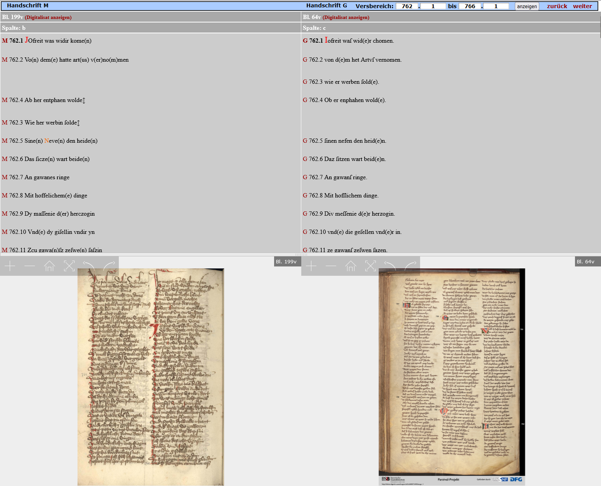
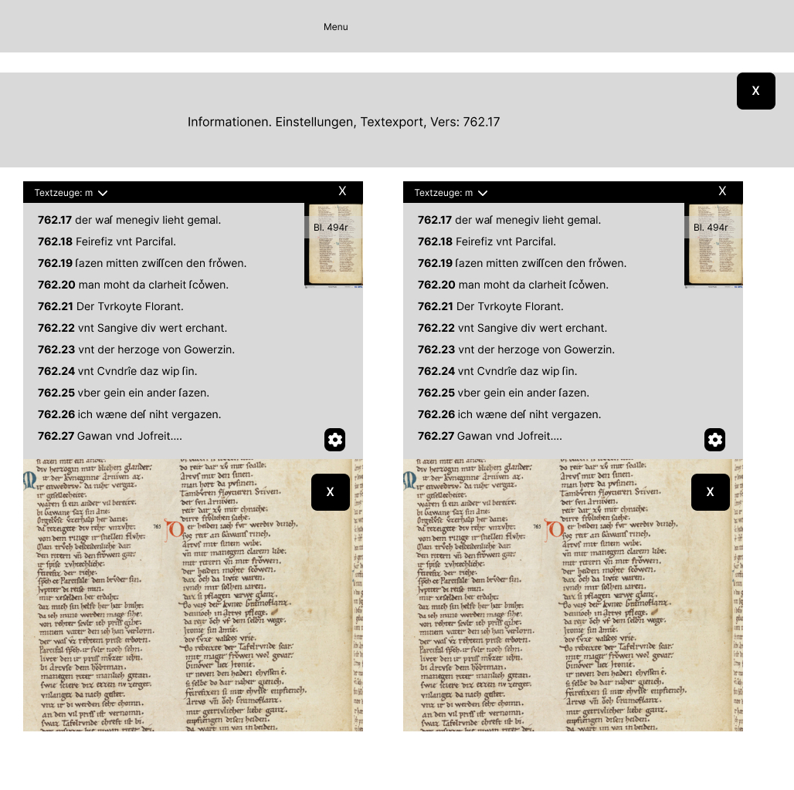
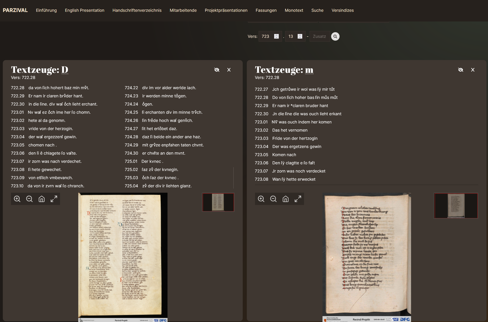
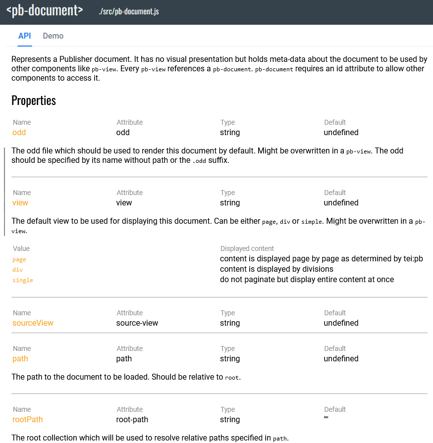

# TEI-Publisher als Backend für Parzival

Die Suche nach dem ewig wartbaren Gral

<style>
  .slide { background: url(img/dsl0.png) center; background-size: cover }
#  .content { filter: invert() }
  code { opacity: 0.8 }
</style>

---

[dsl-unibe-ch.github.io/parzival-imDialog](https://dsl-unibe-ch.github.io/parzival-imDialog/)


---

## Parzival-Legacy

[](https://parzival.unibe.ch/parzdb/index.php)

<style>
    .slide img {
        max-height: 500px;        
    }
</style>
---
### Legacy Workflow

Tustep
`$<*T 103.06>_<vara1>der</var> küniginne über driu lant,`

--> TXT<br />
`21;r;a;103;6;;d(er) kvneginne vber driv lant`

--> SQL-DB --> php --> HTML
`<td><span class="versheader">103.<a name="103.6">6</a></span> <span class="vers-content">d<span class="7">(er)</span> kvneginne vber driv lant</span></td>`

---

## Pilotanwendung TEIPublisher

erste Idee: klassischer TEIPublisher-Stack

Anspruch: Funktionserhalt, UI/UX-Entscheidungen beibehalten

---



---



---

[](https://dhbern.github.io/presentation_parzival/textzeugen/d-mk/719/25)

---

### roadblocks

---

#### Revisionskontrolle

---
Unser Versuch

Single source of truth: github repository.

Wenn sich Daten in github ändern: gh-action vergleicht mit TEI-Publisher und pusht via API

Wenn sich Daten in TEI-Publisher ändern: XQuery Trigger startet gh-action, die Dateien vergleicht.

---

Organisation der Seite passt nicht zu XML-Struktur
<!-- bei Fassungen -->
[Synoptische XML](https://github.com/DHBern/parzival-static-api/blob/master/dist/api/tei/original/syn2.xml) als Grundlage
``` xml
<text>
<body>
<div type="Dreissiger" subtype="d" n="2">
<div type="Textteil" subtype="d" n="2">
<head>*D</head>
```

---

#### Fehlende webcomponents-Expertise am DSL
[](https://cdn.tei-publisher.com/@2.23.2/dist/api.html#pb-document.0)
<style>
    .slide img {
        max-height: 400px;        
    }
</style>
---

## Popup-Publisher
Neues Konzept: Eine komplett statische Seite ohne laufende Serverinfrastruktur
---

TEIPublisher nur für rendering der text views / Transkriptionen

```
fetch(
`${teipb}/parts/${element.handle}.xml/json
?odd=parzival.odd
&view=single
&xpath=//text/body/l[@xml:id=%27${element.handle}_${thirties}.${verse}%27]`)
```

kleingranular möglich durch [XQuery-API (rendered snippets)](https://dhbern.github.io/presentation_parzival/einzelverssynopse/103/07)

---

ODD nur CSS-Klassen
```
<elementSpec ident="seg" mode="change">
    <model behaviour="inline" cssClass="glory-initial">
        <param name="subtype" value="Prachtinitiale"/>
    </model>
    <model behaviour="inline" cssClass="initial" useSourceRendition="true">
        <param name="type" value="Initiale"/>
    </model>
</elementSpec>
```
Funktionalität und Design nur im Frontend

---

[statisches Backend](https://github.com/DHBern/parzival-static-api/blob/master/dist/api/json/contiguous_ranges.json)
```json
{
  "meta": {
    "generated-by": "parzival-static-api\/src\/generate.xsl",
    "task": "contiguous-ranges",
    "generated-on": "2024-09-04T16:16:13.951621295Z",
    "description": "Contiguous ranges of 'Dreissiger' for each edited document;
    this is the backbone for the overview\/linking visualisation a.k.a. 'devil's table'."
  },
  "contiguous-ranges": [
    {
      "values": [
        [ 421, 429 ],
        [ 636, 644 ]
      ],
      "label": "fr1"
    },
  ]
}
```
<style>
  code {
    line-height: 1.1 !important;    
  }
</style>
Strukturdateien und Metadaten versionskontrolliert über eigene API (skriptbasiert, GH Actions) als Grundlage für [erweiterte Features](https://dhbern.github.io/presentation_parzival/)

---

[Starten der TEI-Publisher-App im build](https://github.com/DHBern/presentation_parzival/blob/main/.github/workflows/main.yml)

```
jobs:
  build_site:
    runs-on: ubuntu-latest
    services:
      existdb:
        image: existdb/existdb:6.2.0
        ports:
          - 8081:8080
    steps:
      - name: Install dependencies
        run: npm ci

      - name: start docker
        env:
          EXISTDB_USER: 'admin'
          EXISTDB_PASS: ''
          EXISTDB_SERVER: 'http://127.0.0.1:8081'
        run: |
          npm run installXar
```

---
[Die Webseite als statische Seite mit SvelteKit _herausrechnen_ (prebuild)](https://github.com/DHBern/presentation_parzival/blob/main/src/routes/fassungen/data/%5Bthirties%5D/%2Bserver.js)

```javascript
export async function entries() {
	const entriesArray = Array.from({ length: 827 }, (_, i) => ({ thirties: String(i + 1) }));
	return entriesArray;
}

export const prerender = true;
```
---
### Resultat
1.43 GB an HTML,CSS  und JS Dateien

Vorteile
- extreme Langlebigkeit
- praktisch keine Wartung nötig
- hohe Performanz
- hohe Zugänglichkeit
- Nachhaltig, da nicht rechenaufwändig

Nachteile

- keine Server-seitige Suche möglich (client-seitig schon)
- lange buildzeiten (3h)
---

Danke für die Aufmerksamkeit.

