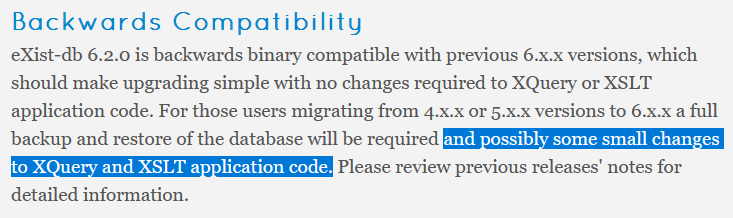

# Parzivals ODD‑Âventiuren

Die Suche nach dem ewig wartbaren Gral

---

## Parzival-Legacy


<style>
    .slide img {
        max-height: 500px;        
    }
</style>
<!-- etwas über die Wichtigkeit des Projekts sagen, wie lange es schon läuft. Dass da über Jahre verschiedene Leute daran gearbeitet haben -->
---
### Legacy Workflow

Tustep
`$<*T 103.07>_[name ref="rego:o0254" type="Ort"]Waleis[/name] und [name ref="rego:o0012" type="Ort"]Anschouwe[/name],`

--> TXT
`21;r;a;103;6;;d(er) kvneginne vber driv lant`

--> SQL-DB --> php --> HTML
`<td><span class="versheader">103.<a name="103.6">6</a></span> <span class="vers-content">d<span class="7">(er)</span> kvneginne vber driv lant</span></td>`

---

## Pilotanwendung TEIPublisher

## erste Idee: klassischer TEIPublisher-Stack

Anspruch: Funktionserhalt, UI/UX-Entscheidungen beibehalten

---


---


---

[](https://dhbern.github.io/presentation_parzival/textzeugen/d-mk/719/25)

---

### roadblocks:

_add some meme here_

---

#### Revisionskontrolle

---
Unser Versuch

Single source of truth: github repository.

Wenn sich Daten in github ändern: gh-action vergleicht mit TEI-Publisher und pusht via API

Wenn sich Daten in TEI-Publisher ändern: XQuery Trigger startet gh-action, die Dateien vergleicht.

---

Organisation der Seite passt nicht zu XML-Struktur
<!-- bei Fassungen -->
Synoptische XML als Grundlage
``` xml
<text>
<body>
<div type="Dreissiger" subtype="d" n="2">
<div type="Textteil" subtype="d" n="2">
<head>*D</head>
```

---

fehlende webcomponents-Expertise
[](https://cdn.tei-publisher.com/@2.23.2/dist/api.html#pb-document.0)

---

### neues Konzept

TEIPublisher nur für rendering der text views / Transkriptionen

```
fetch(
`${teipb}/parts/${element.handle}.xml/json
?odd=parzival.odd
&view=single
&xpath=//text/body/l[@xml:id=%27${element.handle}_${thirties}.${verse}%27]`)
```

kleingranular möglich durch XQuery-API (rendered snippets)

---

ODD nur CSS-Klassen
```
<elementSpec ident="seg" mode="change">
    <model behaviour="inline" cssClass="glory-initial">
        <param name="subtype" value="Prachtinitiale"/>
    </model>
    <model behaviour="inline" cssClass="initial" useSourceRendition="true">
        <param name="type" value="Initiale"/>
    </model>
</elementSpec>
```
Funktionalität und finales Design nur im Frontend
D3 u.ä. (Kartenvisualisierungen) im Frontend

---

[statisches Backend](https://github.com/DHBern/parzival-static-api/blob/master/dist/api/json/contiguous_ranges.json)
```json
{
  "meta": {
    "generated-by": "parzival-static-api\/src\/generate.xsl",
    "task": "contiguous-ranges",
    "generated-on": "2024-09-04T16:16:13.951621295Z",
    "description": "Contiguous ranges of 'Dreissiger' for each edited document;
    this is the backbone for the overview\/linking visualisation a.k.a. 'devil's table'."
  },
  "contiguous-ranges": [
    {
      "values": [
        [ 421, 429 ],
        [ 636, 644 ]
      ],
      "label": "fr1"
    },
  ]
}
```
<style>
  code {
    line-height: 1.1 !important;    
  }
</style>
Strukturdateien und Metadaten versionskontrolliert über eigene API (skriptbasiert, GH Actions)

---

## Red Flags

---

### technisch
---

revision control (data & app config)

---

non-containment;
jede App braucht de facto eigenen exist-server (Fehlendes feinteiliges user-management)

<!-- Hier gibt's keinen zu zeigennden Screenshot, einfach die Situation erklären: obwohl man einen owner definieren können soll, haben wir es nicht geschafft, zwei apps so zu konfigurieren, dass auf der einen nur user des einen projekts, auf der anderen nur user des anderen projekts dokumente ändern können. -->

---

versioning

- verschiedene integrale Bestandteile, **die niemals unabhängig von TEIP genutzt werden** sind einzeln versioniert und sind nur mit bestimmten Versionen kompatibel.
  - Exist-db 6.2.0
  - Tei Publisher 9.0.0
  - Web components 2.19.0
  - API 1.0.0

---

upgrades sind mitnichten simpel und jede major version benötigte manuelle Anpassungen (bei exist teils auf Datenebene).

[](https://exist-db.org/exist/apps/wiki/blogs/eXist/eXistdb620)
[](https://teipublisher.com/exist/apps/tei-publisher/documentation/updating?action=search&view=div&odd=docbook.odd#3.28.15.3)
